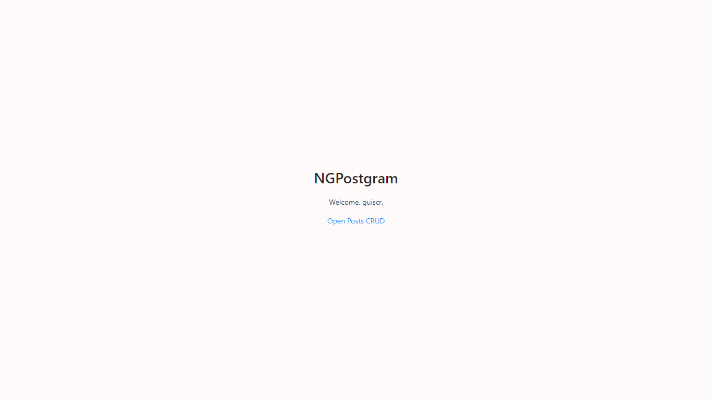

# NGPostgram 📷

<p>A sort of CRUD which allows you to create posts.</p>



## How I installed everything

```
ng new nomedapasta
cd nomedapasta/
npm install graphql graphql-tag
ng add ng-zorro-antd
ng add apollo-angular
```

## Features & Tools

#### Angular

<ul>
<li>Auth Guard</li>
<li>Rotas e Rotas Dinâmicas</li>
<li>Diretivas: NgIf, NgFor, NgModel, NgClass</li>
<li>Input e Output</li>
<li>Pipe existente: uppercase</li>
<li>Pipe personalizada: filter posts</li>
<li>Formulários e Validações com FormGroup</li>
<li>RXJS: BehaviorSubject e Observable</li>
</ul>

### Other tools

<ul>
<li>Ant Design</li>
<li>SCSS</li>
<li>GraphQL</li>
</ul>

## Creator

_Developed by Guilherme Rocha, 05/06 to 09/06 in 2023._

- [Instagram](https://www.instagram.com/devguiga/)
- [Linkedin](https://www.linkedin.com/in/guilhermescr/)
- [YouTube](https://www.youtube.com/@devguiga/)

[⬆ Voltar ao topo](#ngpostgram-📷)<br>
